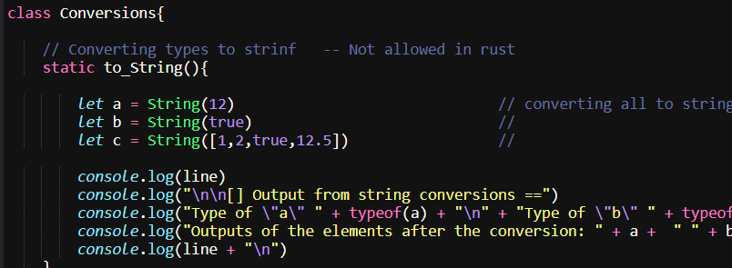

## CMSC 308 Programming Languages 
#### Rust Code Demo and Examples
--------------------------------------------------

<p align="center">
  
  
  
</p>

***
<br>

<p align ="center">



<br>
<i>Logo and sample Source code</i>
</p>


### About Java Script

<p align = "justify">
  <em>Java Script</em> is a high-level programming language and a core backend technology for the Web alongside with HTML and CSS. Often, js is a just-in-time (JIT)- compiled language that comforms with the <a href = "https://en.wikipedia.org/wiki/ECMAScript#:~:text=ECMAScript%20(%2F%CB%88%C9%9Bkm,pages%20across%20different%20web%20browsers.">ECMAScript standard</a> . It features dynamic typing, prototype-based object-orientation, and first class functions. Java script can be executed in any browser as the majority of the browser engines contains a java script run-time engine for executing javascript backends.
</p>

## About this source code
<p align = "justify">
  <b>This source code is intended for demo purposes only</b>. Every source code is written purely with javascript and can be executed in web browser if embedded with an HTML file. Unlike other languages, it fundamentally does not require a package manager, unless a framework was introduced. This repository is a collection of java script source codes that can mainly executed in an online compiler.


  <b>Recommended Online Compiler</br>
  Onlinecompiler: https://onecompiler.com/nodejs
</p>

### Important Note
> This reporsitory is a collection of multiple projects, it is not a standalone

<br>

***

### How to run this source code?
<p align ="justify">
  There are two general ways to run these source codes: Either by using an <a href = "https://onecompiler.com/nodejs">online compiler</a> or by a local compiler (using a Browser as an engine) in visual studio code. However, for your convinience, we uploaded the majority of our source codes in easy runnable interface  in an online compiler
</p>
<br><br>
 
<br>

---

### Source Codes in Online Compiler
<p align ="justify">
  Running a java source code in an online compiler is a straight forward process. <br> <br>
  1. Navigate through the project folder of a specific javascript source code . <br>
  2. Copy the source code from the source file and create a new project in the online compiler. <br>
  3. Paste the source code in the created project from the online compiler and execute the source code. <br>

  For convinience. Here is the list of all of our source codes in an online compiler: <br>
  1. <a href = "https://onecompiler.com/nodejs/44392gv9s">Conversions </a><br>
  2. <a href = "https://onecompiler.com/javascript/44395g9e7">Nominals</a><br>
  3. <a href = "https://onecompiler.com/javascript/44395mewc">Unrunnable Overview</a><br>
  4. <a href = "https://onecompiler.com/javascript/44395qu6u">Sample To-Do App</a>

</p>
<br>

---


### Running a source code in a Local Browser

<p align = "justify">
  Running javascript source codes locally is also a straight forward process. A specific java script source code can be embedded in an html file - runnable using a web browser.
 <br><br>
</p>

<p align = "justify">
  Guide:<br>
  1. First create an HTML file using an IDE of your choice
</p>

```
name_of_your_project.html
```

<p align = "justify">
  2. Use this HTML5 doctype format :
</p>

```html
<!DOCTYPE html>
<html lang="en">
<head>
    <meta charset="UTF-8">
    <meta name="viewport" content="width=device-width, initial-scale=1.0">
    <title>Document</title>
</head>
<body>

    <script>paste your code here</script>
    
</body>
</html>
```

<p align = "justify">
  3. Copy and paste your source code in the html file, under the script tag :
</p>

```html
<!DOCTYPE html>
<html lang="en">
<head>
    <meta charset="UTF-8">
    <meta name="viewport" content="width=device-width, initial-scale=1.0">
    <title>Document</title>
</head>
<body>

    <script>
    // -- Example 1  -- Using the same function on two different object types

        function greet(person) {
        console.log("Hello " + person.name);
        }

        const obj1 = { name: "Kilamanjaro" };            // Object with 1 element
        const obj2 = { name: "Foxtrot", age: 20 };       // Object with 2 element

        greet(obj1);          // Works
        greet(obj2);          // will also work despite being a different type


        // ====================================================================>

        // -- Example 2 -- assigning object values on different object type
        let user = { name: "Alice" };
        let employee = { name: "Alice", salary: 1000 };

        user = employee; 

</script>
    
</body>
</html>
```

<p align = "justify">
  <br>
  4. Save the file
  <br>
</p>

<p >
  5. Execute the file in a browser and use the <em>inspect element</em> to view the ooutput 
  <br><br>

  
  
</p>


---
## Cloning the Repository
<p align ="justify">
  
</p>

### Open your terminal and run these commands
<p align ="justify"> Make sure that git. command line  is installed in your devices. Otherwise, you can install it from <a href = "https://git-scm.com/">here</a>
<br><br>

</p>

<p>Select your file directory</p>

> Note: The directory should be encapsulated with "" symbol,  e.g. cd "C:\Brave Downloads\Ran"

```bash
cd <path from your device>
```
<p></p>

<p>
  then run the clone command from your directory using this command
</p>

```console
git clone https://github.com/KalaPhantom/Java-Script-Sample-Demo_TypeChecks.git
```

<p>
  After the cloning process, you must navigate to a specific file folder, as this project repository is not a standalone project. You can use the same cd command to do so <br>
  <br> Example:
</p>

```bash
cd "D:\Brave Downloads\Ran\CMSC-308_RUST-CODE_DEMO\(Terminal) Todo App - For Overview Purposes"
```

<p>
   You can now open the source codes in vs code. You can use this command to open the directory directly in vs-code
</p>

```console 
code .
```

<p><br></p>


---
### Created by:

<p align="center">
   
   
  <br><br>
  Roño, Keeshia Mae S. <br>
  Lerado, Allen N.
</p>


